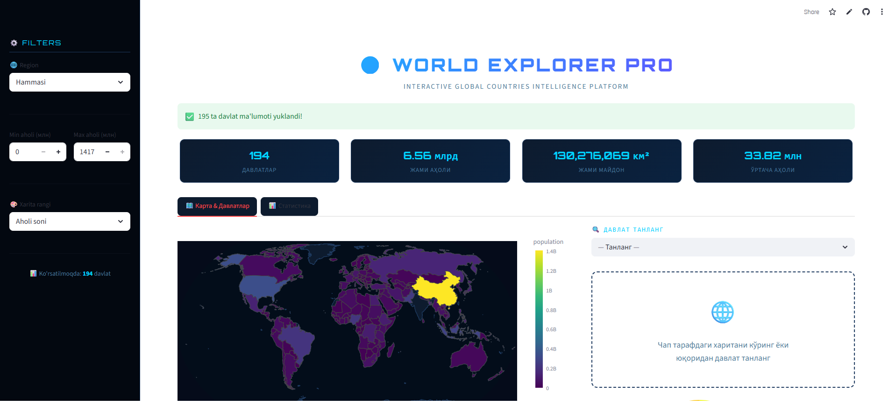

# 🌍 World Explorer Pro

**World Explorer Pro** — bu `Streamlit + Plotly` asosida qurilgan interaktiv global davlatlar platformasi.
Ilova dunyo davlatlari haqida vizual va statistik ma'lumotlarni ko'rsatadi: xarita, aholi, maydon, bayroq, poytaxt, iqtisodiy ko'rsatkichlar va boshqa qo'shimcha country intelligence ma'lumotlari.

## ✨ Asosiy imkoniyatlar

- 🌐 **195 ta davlat ma'lumoti**
- 🗺️ **Interaktiv choropleth world map**
- 🏳️ **Davlat bayrog'i va asosiy ma'lumotlar**
- 👤 **Prezident / davlat rahbari**
- 💰 **GDP va GDP per capita**
- 🌾 **Qishloq xo'jaligi ulushi**
- 🏭 **Sanoat ulushi**
- 🏢 **Xizmatlar ulushi**
- 📈 **Inflatsiya**
- ❤️ **Umr davomiyligi**
- 🏙️ **Shahar aholisi foizi**
- 📊 **Regionlar bo'yicha statistika**
- 🎛️ **Sidebar filterlar**
- ⚡ **Real-time API integration**

## 🧠 Foydalanilgan texnologiyalar

- **Python**
- **Streamlit**
- **Plotly**
- **Pandas**
- **Requests**

## 🔌 Foydalanilgan API manbalari

Ilova quyidagi tashqi API manbalaridan foydalanadi:

- **REST Countries API** — davlatlarning asosiy metadata ma'lumotlari uchun
- **World Bank API** — iqtisodiy indikatorlar uchun
- **Wikidata SPARQL** — prezident / head of state ma'lumotlari uchun

## 📦 O'rnatish

Avval repository'ni clone qiling:

```bash
git clone https://github.com/YOUR_USERNAME/world-explorer-pro.git
cd world-explorer-pro
```

So'ng kerakli kutubxonalarni o'rnating:

```bash
pip install -r requirements.txt
```

## ▶️ Ishga tushirish

```bash
streamlit run app.py
```

Agar fayl nomi boshqacha bo'lsa, masalan `app_195_davlat_fixed.py`:

```bash
streamlit run app_195_davlat_fixed.py
```

## 📁 Loyiha tuzilmasi

```bash
world-explorer-pro/
│
├── app.py
├── requirements.txt
└── README.md
```

## 🖼️ Ilova ichida nimalar bor?

### 1. World Map
- Davlatlar xaritada ko'rsatiladi
- Rang aholi soni yoki maydonga qarab o'zgaradi

### 2. Country Detail Panel
Tanlangan davlat uchun:
- bayroq
- rasmiy nom
- poytaxt
- region
- mustaqillik holati
- quruqlik / dengizga chiqish holati
- prezident
- GDP
- GDP per capita
- agriculture / industry / services ulushi
- inflation
- life expectancy
- urban population foizi

### 3. Region Statistics
- regionlar bo'yicha davlatlar soni
- jami aholi
- jami maydon
- vizual diagrammalar

## ⚠️ Muhim eslatmalar

- Ilova ishlashi uchun **internet kerak**, chunki ma'lumotlar tashqi API'lardan olinadi.
- Ayrim davlatlarda ba'zi ko'rsatkichlar `—` bo'lib chiqishi mumkin. Bu kod xatoligi emas, balki tashqi data source'da ma'lumot yo'qligi bilan bog'liq.
- Prezident yoki iqtisodiy indikatorlar ba'zi mamlakatlarda vaqtincha chiqmasligi mumkin.

## 🚀 Kelajakdagi rejalashtirilgan upgrade'lar

- davlat chegaralarini nom bilan ko'rsatish
- country comparison mode
- PDF report export
- map click orqali davlat tanlash
- search by president / GDP / capital
- to'liq o'zbekcha nomlar bazasi

## 💻 requirements.txt

```txt
streamlit>=1.32.0
plotly>=5.20.0
pandas>=2.2.2
requests>=2.31.0
```

## 📸 Screenshot

Bu bo'limga keyin GitHub uchun screenshot qo'shishingiz mumkin:

```md

```

## README uchun qisqa GitHub description

Repository description uchun qisqa matn:

> Interactive Streamlit world explorer with 195 countries, map visualization, flags, GDP, president data, and regional analytics.

## GitHub topics tavsiyasi

```txt
streamlit plotly python data-visualization world-map countries geopolitics statistics dashboard
```
